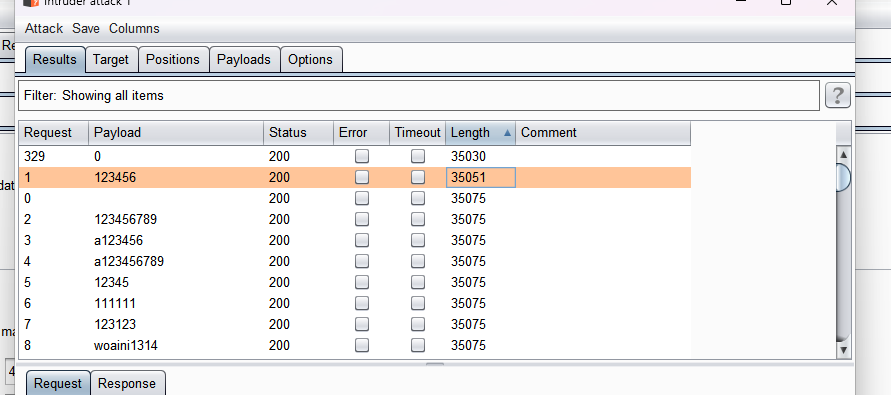
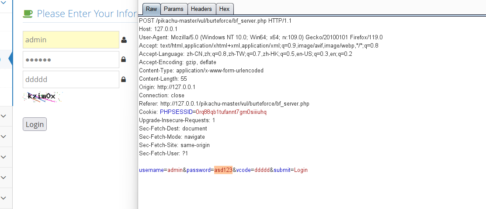
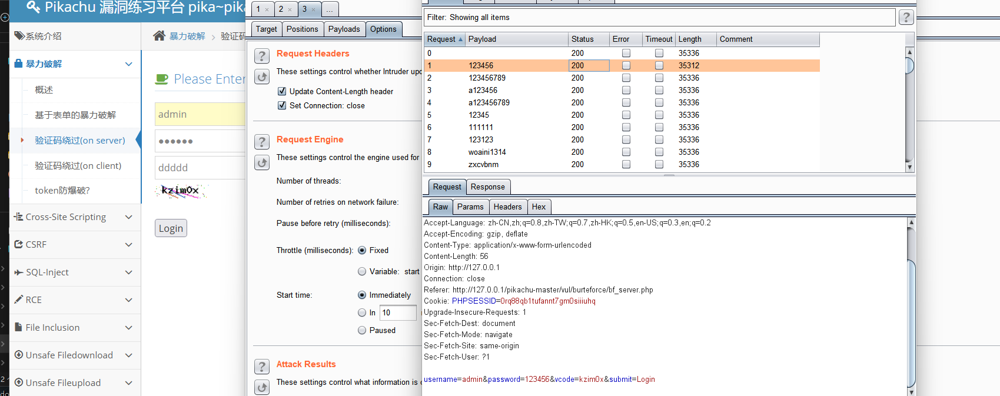
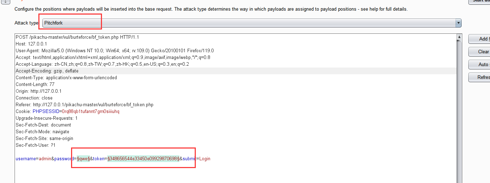
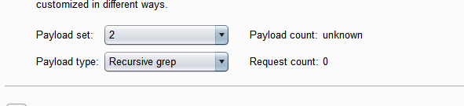
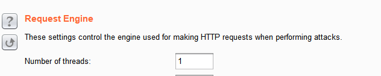
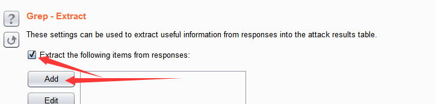
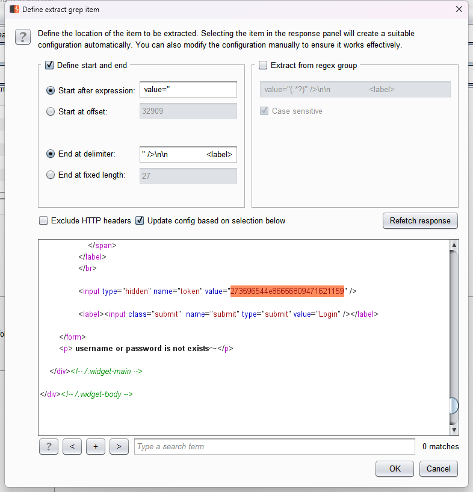

## 逻辑漏洞 2023/11/03

**0x01 暴力破解 (pikachu)**

**0x001 爆破** 
直接bp爆破 导入top1w的directory爆破 根据length长度来判断



**0x002 验证码绕过**

这里可以先输错一个验证码 然后bp抓包 在输入对的验证码在bp上 然后就可以绕过验证码防护 开始爆破 密码为123456


**0x003 客户端验证码绕过**
先随便输一个验证码上去 然后bp抓包 结果发现bp没有抓到响应包 但是浏览器弹了一个js的弹窗 很明显的一个只针对前端的一个js验证 尝试直接F12然后禁用javascript 在bp抓包爆破 成功拿到密码123456

**0x004 token验证绕过**
一个token绕过的爆破 先简单抓个包

```html
username=admin&password=qwe&token=348656544e33450e09929870698&submit=Login
```

开始爆破:
发送到爆破模块 



设置攻击模式为Pithfork (干草插) 也就是逐一设置爆破方式 
设置第二个值的payload方式为

也就是递归查询，从response中提取user_token 
接着进入Options模块 找到Request Engine(请求引擎) 将线程设置为1 因为只有当上一个请求返回token值的时候才能发一次请求

继续设置Redirections(重导) 选择Always;


找到Grep-Extract：


（从响应中提取以下数据）， 点击Add添加: 



然后设置第一个payload 自定义字典爆破 得出密码是123456；


0x02